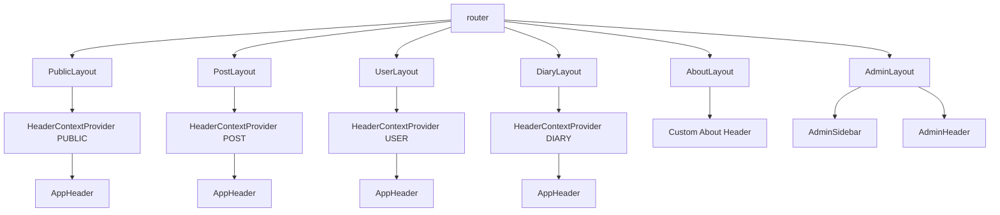
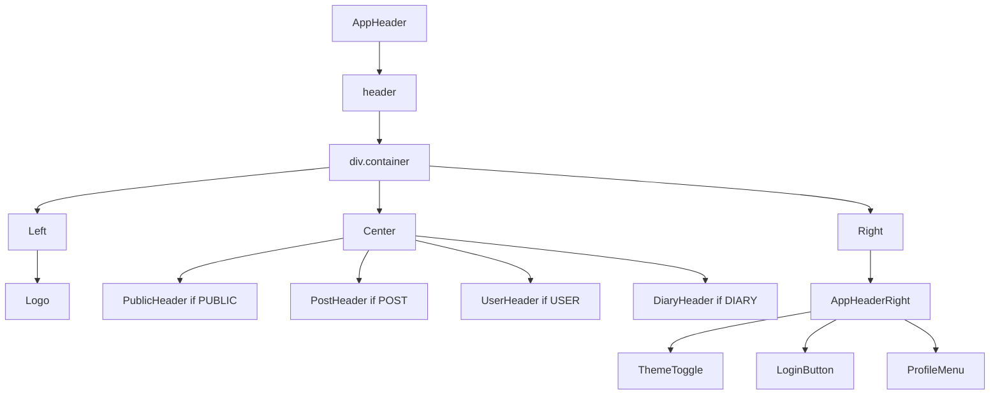
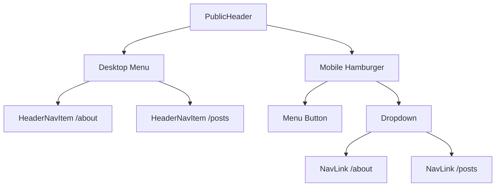
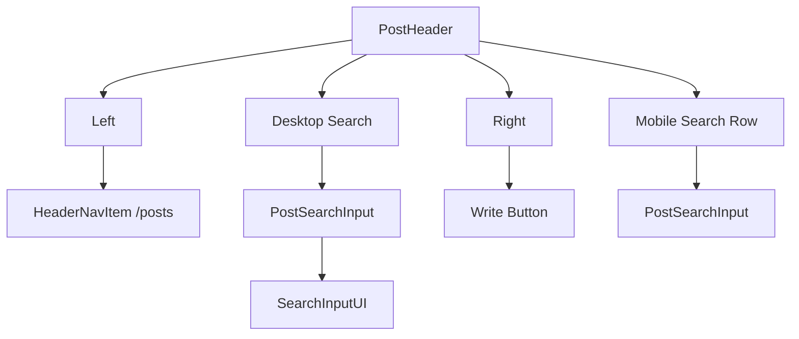
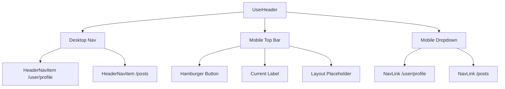
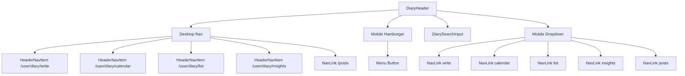
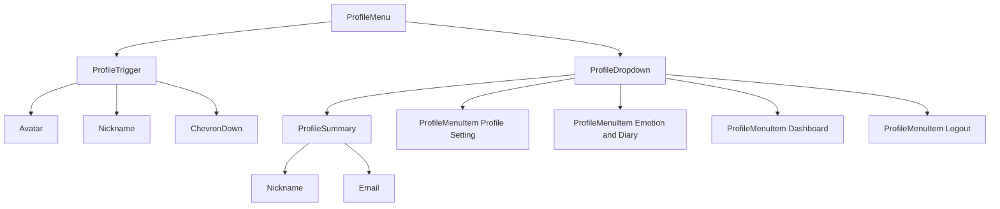
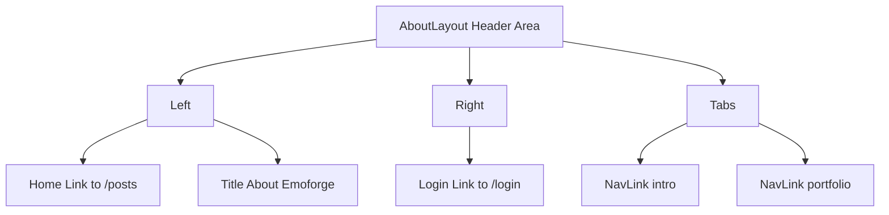
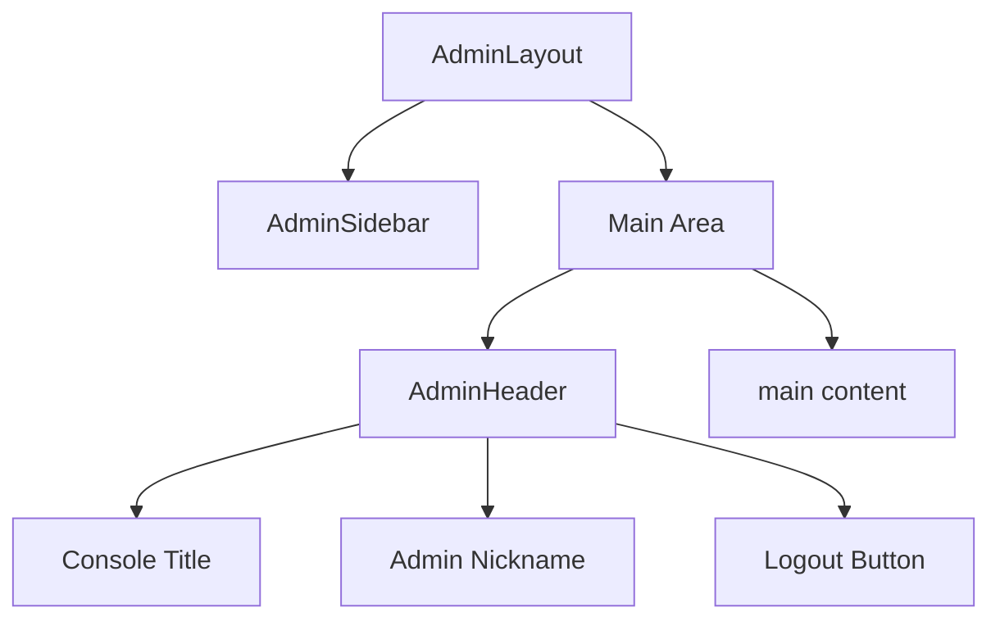

# Frontend Header Tree

작성일: 2026-03-10

## 개요

이 프로젝트의 Header 구조는 크게 두 갈래입니다.

- 일반 사용자 영역: `AppHeader` 기반 공통 헤더
- 관리자 영역: `AdminHeader` 기반 별도 헤더

또한 `AboutLayout`은 `AppHeader`를 사용하지 않고 자체 상단 바를 직접 구현합니다.

## 1. 라우팅/레이아웃 기준 Header 구조

설명:

- `PublicLayout`, `PostLayout`, `UserLayout`, `DiaryLayout`은 모두 `HeaderContextProvider`로 컨텍스트를 주입한 뒤 `AppHeader`를 렌더링합니다.
- `AboutLayout`은 별도 탭형 상단 바를 직접 구성합니다.
- `AdminLayout`은 사용자 공통 헤더와 분리되어 `AdminSidebar + AdminHeader` 조합을 사용합니다.

## 2. 공통 AppHeader 내부 구조

설명:

- 좌측은 항상 `Logo`입니다.
- 중앙은 컨텍스트 값에 따라 다른 헤더 컴포넌트가 교체됩니다.
- 우측은 공통으로 `ThemeToggle`이 있고, 로그인 상태 및 컨텍스트에 따라 `LoginButton` 또는 `ProfileMenu`가 보입니다.

## 3. 컨텍스트별 Center 영역 상세 트리

### 3-1. PublicHeader

### 3-2. PostHeader

### 3-3. UserHeader

### 3-4. DiaryHeader

설명:

- `PublicHeader`와 `UserHeader`는 데스크톱/모바일 메뉴 전환형 구조입니다.
- `PostHeader`는 검색과 글쓰기 진입이 핵심입니다.
- `DiaryHeader`는 메뉴 수가 가장 많고, 검색 입력창이 항상 우측에 붙습니다.

## 4. 우측 ProfileMenu 상세 구조

설명:

- `ProfileMenu`는 드롭다운 토글 구조입니다.
- 트리거에는 프로필 이미지, 닉네임, 화살표 아이콘이 들어갑니다.
- 드롭다운에는 사용자 요약 정보와 주요 이동 액션, 로그아웃 액션이 배치됩니다.

## 5. 별도 Header 구조

### 5-1. AboutLayout Header

### 5-2. Admin Header

## 6. 관찰 포인트

- 공통 사용자 헤더는 `Logo + 컨텍스트별 Center + 우측 액션`이라는 일관된 패턴을 따릅니다.
- `AboutLayout`, `AdminLayout`은 공통 헤더 체계 밖에 있는 별도 구현입니다.
- `DiaryLayout.tsx` 내부 함수명이 `PostLayout`으로 선언되어 있어 이름 불일치가 있습니다.
- 현재 라우터에서는 `DiaryLayout`이 직접 연결되지 않고, `/user` 경로 하위는 `UserLayout` 기반으로 동작합니다.

## 참고 파일

- `src/app/router.tsx`
- `src/layouts/PublicLayout.tsx`
- `src/layouts/PostLayout.tsx`
- `src/layouts/UserLayout .tsx`
- `src/layouts/DiaryLayout.tsx`
- `src/layouts/AboutLayout.tsx`
- `src/layouts/AdminLayout.tsx`
- `src/layouts/AdminHeader.tsx`
- `src/layouts/components/header/AppHeader.tsx`
- `src/layouts/components/header/AppHeaderRight.tsx`
- `src/layouts/components/header/context/*.tsx`
- `src/layouts/components/header/profileMenu/*.tsx`
